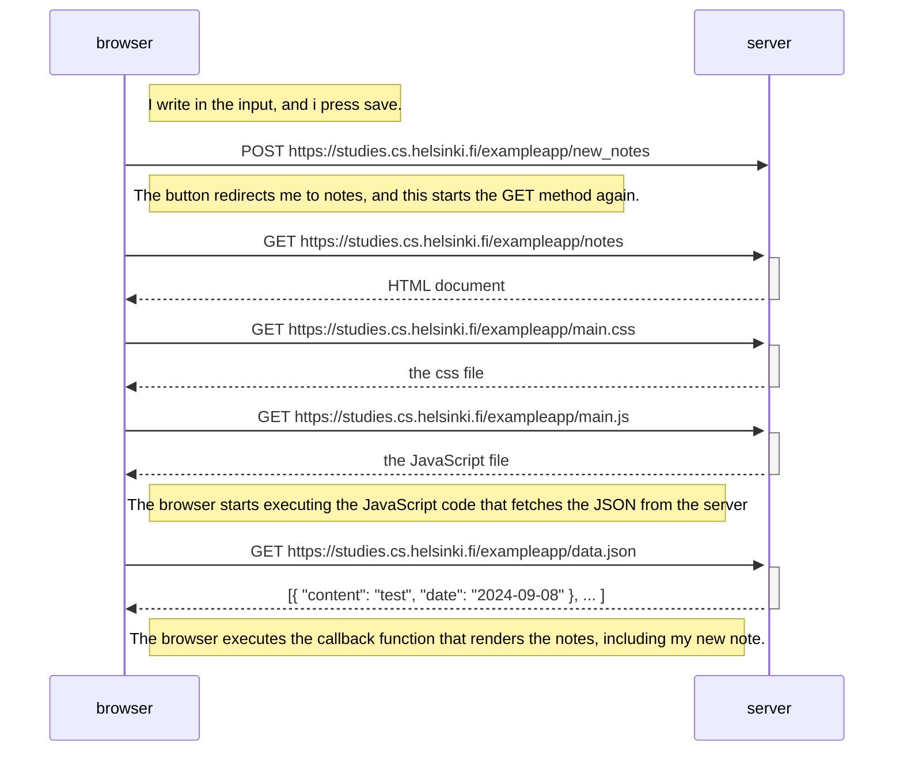

```mermaid

sequenceDiagram
    participant browser
    participant server

Note right of browser: I write in the input, and i press save.

    browser->>server: POST https://studies.cs.helsinki.fi/exampleapp/new_notes
    activate server

Note right of browser: The button redirects me to notes, and this starts the GET method again.

    browser->>server: GET https://studies.cs.helsinki.fi/exampleapp/notes
    activate server
    server-->>browser: HTML document
    deactivate server

    browser->>server: GET https://studies.cs.helsinki.fi/exampleapp/main.css
    activate server
    server-->>browser: the css file
    deactivate server

    browser->>server: GET https://studies.cs.helsinki.fi/exampleapp/main.js
    activate server
    server-->>browser: the JavaScript file
    deactivate server

    Note right of browser: The browser starts executing the JavaScript code that fetches the JSON from the server

    browser->>server: GET https://studies.cs.helsinki.fi/exampleapp/data.json
    activate server
    server-->>browser: [{ "content": "test", "date": "2024-09-08" }, ... ]
    deactivate server

    Note right of browser: The browser executes the callback function that renders the notes, including my new note.
```
