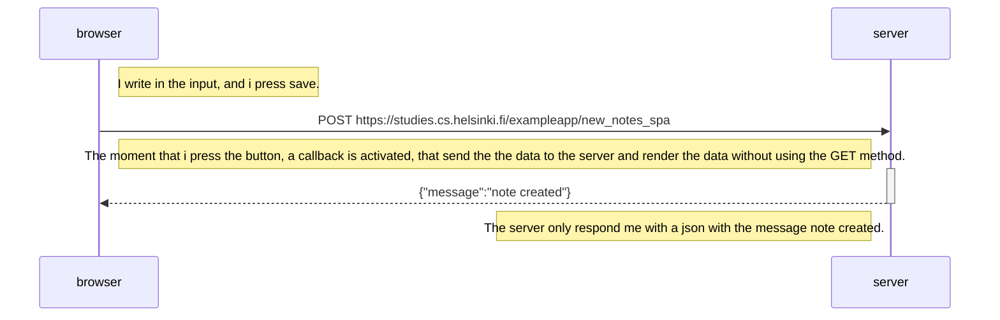

```mermaid

sequenceDiagram
    participant browser
    participant server

Note right of browser: I write in the input, and i press save.

    browser->>server: POST https://studies.cs.helsinki.fi/exampleapp/new_notes_spa

Note right of browser: The moment that i press the button, a callback is activated, that send the the data to the server and render the data without using the GET method.

    activate server
    server-->>browser: {"message":"note created"}
    deactivate server

Note left of server: The server only respond me with a json with the message note created.

```
